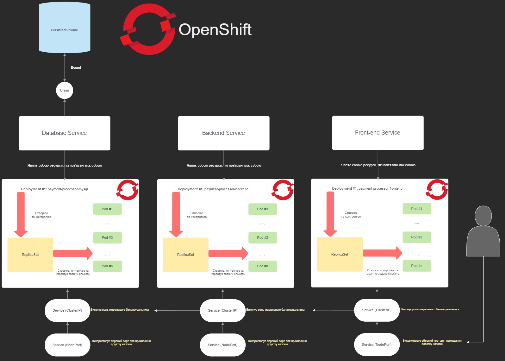

# Deployment steps explained

Let me clarify all of the steps a deployer should make to have this whole application work

* The first microservice should me **MySQL** database which depends on **ConfigMap** and Secret so you should do something like this:
  * `~$ kubectl create configmap mysql-db-migration --from-file=db.sql`
* After that **MySQL** deployment contains secret so let's have this work done by following command:
  * `~$ kubectl create secret generic mysql-root-password --from-literal=password=my_secret_password`
    * Whenever you'll be doing some like `~$ kubectl describe secret mysql-root-password` the command will return you information about the secret including the key named password which will be encoded. 
    * To decode it and verify that the encoded variant is a proper password let's do such command: `echo $(kubectl get secret mysql-root-password -o jsonpath="{.data.password}") | base64 --decode` and it'll print out your initial password without encryption.
    * To verify that your initial password will be look like encrypted variant inside password field do something like `~$ echo my_secret_password | base64` and you'll see that the result will be the same
* Then you may run _mysql.yaml_ by that command: `~$ kubectl create -f mysql.yaml`
* Deploy **MySQL** service and **MySQL** NodePort service if you need to access your database _outside_ of the cluster.
* After **MySQL** db service you should start backend.yaml but before doing that please verify if you have appropriate images and those were pushed into its registries
* Deploy services for backend
* Build frontend image, push it to the registry and deploy the last _frontend.yaml_ and its services (**NodePort** is necessary because the frontend is the last and the only entrypoint into your application)
* That's it, the simple microservice-based application running on the Kubernetes cluster. **Enjoy!**
